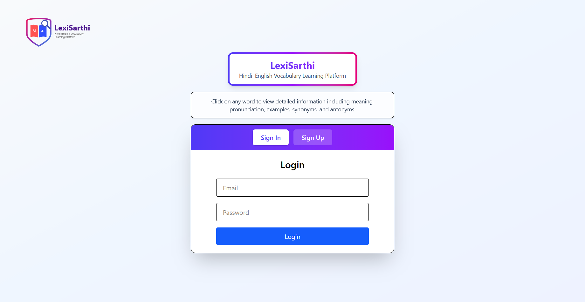
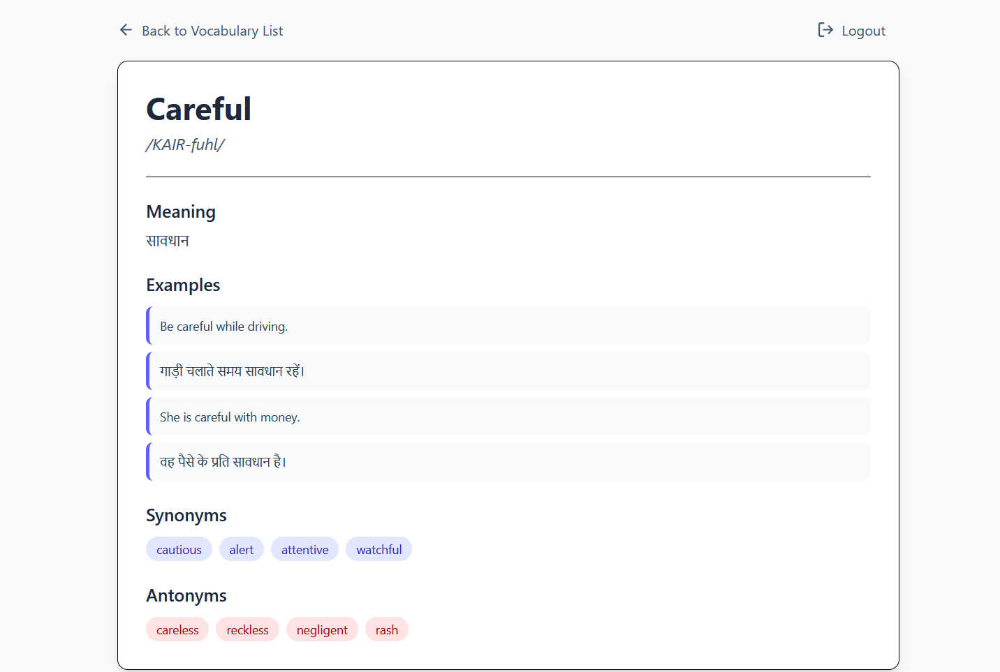
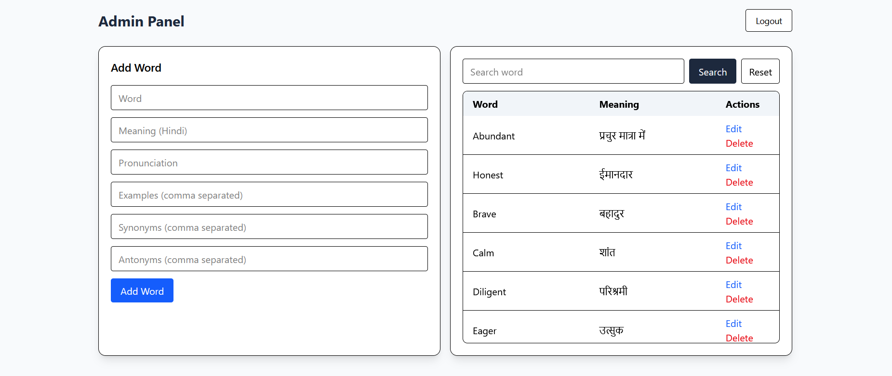

# 📚 LexiSarthi

A full-stack **Hindi–English Vocabulary Learning Platform** designed to help users improve English vocabulary with **Hindi meanings, pronunciation, examples, synonyms, antonyms**, and **daily word emails**.

🔗 **Live App:** [https://lexi-sarthi.vercel.app](https://lexi-sarthi.vercel.app)
🔗 **Backend API:** [https://lexisarthi-backend.onrender.com](https://lexisarthi-backend.onrender.com)
🔗 **GitHub Repository:** [https://github.com/CodePhantom01/LexiSarthi](https://github.com/CodePhantom01/LexiSarthi)

---

## 🖼️ Screenshots

### Authentication



### Word Details



### Admin Panel



---

## ✨ Features

* 🔍 English vocabulary with Hindi meanings
* 🔐 Secure JWT authentication (Login / Signup)
* 🧑‍💼 Admin panel for managing words
* 📧 Daily vocabulary emails using cron jobs
* 👤 User profile & email preferences
* 📱 Responsive UI built with Tailwind CSS

---

## 🛠️ Tech Stack

### Frontend

* React 19, Vite
* React Router DOM
* Tailwind CSS
* Axios

### Backend

* Node.js, Express.js
* MongoDB Atlas, Mongoose
* JWT Authentication, Bcrypt
* Node-cron, Nodemailer

---

## 🚀 Getting Started

### Prerequisites

* Node.js (v14+)
* MongoDB Atlas or Local MongoDB

### Installation

```bash
git clone https://github.com/CodePhantom01/LexiSarthi.git
cd LexiSarthi
```

```bash
# Backend
cd backend
npm install
```

```bash
# Frontend
cd ../frontend
npm install
```

---

## 🔑 Environment Variables

### Backend (`backend/.env.example`)

```env
PORT=5000
JWT_SECRET=your_jwt_secret
ADMIN_EMAIL=admin@example.com
MONGODB_URI=your_mongodb_atlas_uri

EMAIL_USER=your_email@gmail.com
EMAIL_PASS=your_email_app_password
```

### Frontend (`frontend/.env.example`)

```env
VITE_API_URL=https://lexisarthi-backend.onrender.com
VITE_ADMIN_EMAIL=admin@example.com
```

⚠️ **Never commit real credentials to GitHub.**
Reference: [https://docs.github.com/en/code-security](https://docs.github.com/en/code-security)

---

## ▶️ Running the Application

```bash
# Backend
npm run dev
```

```bash
# Frontend
npm run dev
```

---

## 📁 Project Structure

```bash
LexiSarthi/
├── backend/
│   ├── src/
│   │   ├── config/
│   │   │   ├── db.js
│   │   │   └── jwtAuth.js
│   │   ├── controllers/
│   │   │   ├── userController.js
│   │   │   └── wordController.js
│   │   ├── jobs/
│   │   │   └── dailyWordJob.js
│   │   ├── middlewares/
│   │   │   ├── adminMiddleware.js
│   │   │   └── jwtAuthMiddleware.js
│   │   ├── models/
│   │   │   ├── userModel.js
│   │   │   └── wordModel.js
│   │   ├── routes/
│   │   │   ├── userRoutes.js
│   │   │   └── wordRoutes.js
│   │   └── services/
│   ├── app.js
│   ├── server.js
│   ├── package.json
│   └── .env
│
├── frontend/
│   ├── public/
│   ├── src/
│   │   ├── assets/
│   │   │   └── Logo.svg
│   │   ├── pages/
│   │   │   ├── Home.jsx
│   │   │   ├── Login.jsx
│   │   │   ├── Signup.jsx
│   │   │   ├── Authentication.jsx
│   │   │   ├── WordDetails.jsx
│   │   │   ├── UserProfile.jsx
│   │   │   └── AdminPage.jsx
│   │   ├── App.jsx
│   │   ├── main.jsx
│   │   └── index.css
│   ├── index.html
│   ├── tailwind.config.js
│   ├── vite.config.js
│   ├── package.json
│   └── .env
│
├── screenshots/
│   ├── login.png
│   ├── word-details.png
│   └── admin-panel.png
│
└── README.md
```

---

## 🔀 Authentication & Routing

* JWT token stored in `localStorage`
* Protected routes redirect unauthenticated users
* Admin routes secured on both frontend and backend

---

## 🔌 REST API Endpoints

### User Routes (`/api/users`)

* `POST /signup`
* `POST /login`
* `GET /profile`
* `PUT /updateProfile`
* `PATCH /enable-daily-email`
* `DELETE /deleteProfile`

### Word Routes (`/api/words`)

* `GET /getAllWords`
* `GET /searchWord/:word`
* `POST /addWord` *(Admin only)*
* `PUT /updateWord/:word` *(Admin only)*
* `DELETE /deleteWord/:word` *(Admin only)*

---

## 🔒 Security

* JWT-based authentication
* Password hashing using bcrypt
* Role-based admin authorization
* CORS configuration

Best practices:
[https://expressjs.com/en/advanced/best-practice-security.html](https://expressjs.com/en/advanced/best-practice-security.html)

---

## ⏰ Automated Emails

* Daily cron job runs at **9:00 AM**
* Sends vocabulary emails to subscribed users
* Implemented using `node-cron` and `nodemailer`

Reference:
[https://www.npmjs.com/package/node-cron](https://www.npmjs.com/package/node-cron)

---

## 🗄️ Database

* MongoDB Atlas (Cloud Database)
* Mongoose ODM
* Secure environment-based configuration

Docs:
[https://www.mongodb.com/atlas/database](https://www.mongodb.com/atlas/database)

---

## ❤️ Built With MERN Stack

---